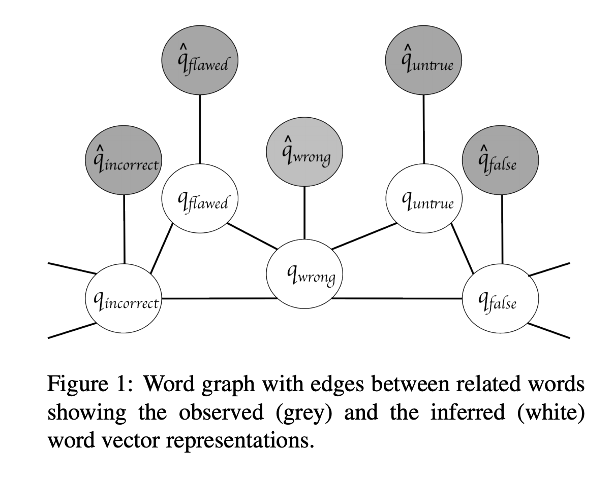

# Implementation of Retrofitting Word Vectors to Semantic Lexicons

This code contains an implementation of this [paper.](https://www.cs.cmu.edu/~hovy/papers/15HLT-retrofitting-word-vectors.pdf)

The technique uses a clever method to use the lexicon to update the original word vectors such that the new word vectors are close to the original word vectors and neighbours in the lexicon.

